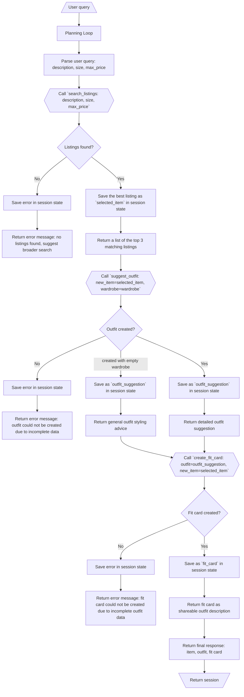

# FitFindr — planning.md

> Complete this document before writing any implementation code.
> Your spec and agent diagram are what you'll use to direct AI tools (Claude, Copilot, etc.) to generate your implementation — the more specific they are, the more useful the generated code will be.
> Your planning.md will be reviewed as part of your submission.
> Update it before starting any stretch features.

---

## Tools

List every tool your agent will use. For each tool, fill in all four fields.
You must have at least 3 tools. The three required tools are listed — add any additional tools below them.

### Tool 1: search_listings

**What it does:**
<!-- Describe what this tool does in 1–2 sentences -->
Finds the matching thrift item based on the user's description.

**Input parameters:**
<!-- List each parameter, its type, and what it represents -->
- `description` (str): User's description of the thrift item they are searching for.
- `size` (str): The size of the thrift item being searched.
- `max_price` (float): The maximum price the user is willing to pay for the thrift item.

**What it returns:**
<!-- Describe the return value — what fields does a result contain? -->
The result should contain a list of up 3 matching listings. Only the top listing will be chosen.

**What happens if it fails or returns nothing:**
<!-- What should the agent do if no listings match? -->
- The agent should return an empty list.
- The agent should tell the user that no listings were found and suggest different size, max price, or description.

---

### Tool 2: suggest_outfit

**What it does:**
<!-- Describe what this tool does in 1–2 sentences -->
Suggests an outfit combination using the new thrifted item and the user’s wardrobe.

**Input parameters:**
<!-- List each parameter, its type, and what it represents -->
- `new_item` (dict): The thrifted item found in `search_listings()`.
- `wardrobe` (dict): Items from the user's wardrobe.

**What it returns:**
<!-- Describe the return value -->
A detailed outfit suggestion combining the thrifted item and the user's clothes. The message should be brief, descriptive, and contain instructions on how to put the outfit together.

**What happens if it fails or returns nothing:**
<!-- What should the agent do if the wardrobe is empty or no outfit can be suggested? -->
The agent should return an error message stating that the outfit could not be created and to ensure a thrifted item exists. If the wardrobe is empty then the agent should return basic styling advice regarding the item.

---

### Tool 3: create_fit_card

**What it does:**
<!-- Describe what this tool does in 1–2 sentences -->
Generates a short, shareable outfit description.

**Input parameters:**
<!-- List each parameter, its type, and what it represents -->
- `outfit` (str): The suggested outfit description created in `suggest_outfit()`.

**What it returns:**
<!-- Describe the return value -->
A short, instagram-like description of the complete outfit, similar to that of a caption on a social media post.

**What happens if it fails or returns nothing:**
<!-- What should the agent do if the outfit data is incomplete? -->
The agent should return an error message stating that the fit card cannot be created.

---

### Additional Tools (if any)

<!-- Copy the block above for any tools beyond the required three -->

---

## Planning Loop

**How does your agent decide which tool to call next?**
<!-- Describe the logic your planning loop uses. What does it look at? What conditions change its behavior? How does it know when it's done? -->
The agent will use a conditional loop that checks the session state after each tool call before it decides what to do next.
The agent starts by analyzing the user's query and parsing it into `description`, `size`, `max_price`. Using that information, it will call `search_listings(description, size, max_price)`. If no listings are found, the agent returns a failure message telling the user that no listings were found and what to try differently. It does not call any of the other tools because there is no item to style for `suggest_outfit`. If listings are found, the best match is saved as `selected_item` in session state.
Once `selected_item` is saved the agent calls `suggest_outfit(new_item=selected_item, wardrobe=wardrobe)`. After running, it checks if an outfit suggestion was created. If no outfit suggestion was created, the agent returns an error message stating that the outfit could not be created and to ensure a thrifted item exists. If the wardrobe is empty, the agent will return basic outfit advice. If an outfit suggestion was created, the agent saves it in session state as `outfit_suggestion` and returns the suggestion. Once that's done it calls `create_fit_card(outfit=outfit_suggestion, new_item=selected_item)`. If the fit_card fails, the agent returns an error message stating that the fit card cannot be created. If the fit card is created successfully, the agent saves it in session state as `fit_card` and returns it as the final response.
The loop ends when the agent has either created a fit card or returns an error message.

---

## State Management

**How does information from one tool get passed to the next?**
<!-- Describe how your agent stores and accesses state within a session. What data is tracked? How is it passed between tool calls? -->
The agent stores information in a session state dictionary and is updated after each tool call.
The session state tracks:

- user_query: the original request
- description: the item description extracted from the user request
- size: the requested item size
- max_price: the maximum price the user is willing to pay
- wardrobe: the user's wardrobe items
- search_results: the listings returned by `search_listings`
- selected_item: the best matching listing chosen from the search results
- outfit_suggestion: the outfit suggestion returned by `suggest_outfit`
- fit_card: the outfit description returned by `create_fit_card`
- error: any failure message that should be shown to the user

Example: After `search_listings()` returns the matching listings, the best item is saved as `selected_item`. That selected item is then passed into `suggest_outfit()`. After `suggest_outfit()` returns an outfit, the outfit is saved as `outfit_suggestion` and passed into `create_fit_card()`.

---

## Error Handling

For each tool, describe the specific failure mode you're handling and what the agent does in response.

| Tool | Failure mode | Agent response |
| ---- | ------------ | -------------- |
| search_listings | No results match the query | "No listings were found that matched your request. Try broadening the description, choosing a different size, or increasing the budget." |
| suggest_outfit | Wardrobe is empty | Returns basic, general styling advice for the thrifted item |
| create_fit_card | Outfit input is missing or incomplete | "The fit card cannot be created without both a selected item and an outfit suggestion." |

---

## Architecture

<!-- Draw a diagram of your agent showing how the components connect:
     User input → Planning Loop → Tools (search_listings, suggest_outfit, create_fit_card)
                                                                          ↕
                                                                   State / Session
     Show what triggers each tool, how state flows between them, and where error paths branch off.
     ASCII art, a Mermaid diagram (https://mermaid.js.org/syntax/flowchart.html), or an embedded
     sketch are all fine. You'll share this diagram with an AI tool when asking it to implement
     the planning loop and each individual tool. -->

---

## AI Tool Plan

<!-- For each part of the implementation below, describe:
     - Which AI tool you plan to use (Claude, Copilot, ChatGPT, etc.)
     - What you'll give it as input (which sections of this planning.md, your agent diagram)
     - What you expect it to produce
     - How you'll verify the output matches your spec before moving on

     "I'll use AI to help me code" is not a plan.
     "I'll give Claude my Tool 1 spec (inputs, return value, failure mode) and ask it to implement
     search_listings() using load_listings() from the data loader — then test it against 3 queries
     before trusting it" is a plan. -->

**Milestone 3 — Individual tool implementations:**
I will use Claude or ChatGPT to help implement the three required tools. For `search_listings()`, I will provide the Tool 1 section of this document and ask it to implement the function using `load_listings()`. I will verify the function by testing three queries, one of which will return an error message.
For `suggest_outfit()`, I will provide the Tool 2 section, the wardrobe schema, and the functions `get_example_wardrobe()` and `get_empty_wardrobe()`. I will ask the AI to help write a function that combines the selected thrift item with compatible wardrobe pieces to create an outfit suggestion. I will verify it by testing an example wardrobe and an empty wardrobe.
For `create_fit_card()`, I will provide the Tool 3 section and ask the AI to create a function that turns the selected item and outfit suggestion into a short, shareable caption. I will verify it by checking that the output mentions the thrifted item and sounds like a social media caption. I will verify that it does not generate a fit card when required inputs are missing.

**Milestone 4 — Planning loop and state management:**
I will use Claude or ChatGPT to help implement the planning loop using the Planning Loop, State Management, Error Handling, and Architecture sections of this document. I will ask the AI to produce a loop that calls `search_listings()`, checks whether results exist, stores the selected item in session state and returns its details, calls `suggest_outfit()`, stores the outfit suggestion and returns the suggestion, calls `create_fit_card()`, and then returns the final response.

I will verify the planning loop by tracing the session state after each tool call. I will test a successful full interaction that uses all three tools, a search failure where no listings are found, and an empty wardrobe case where the agent must still respond gracefully.

---

## A Complete Interaction (Step by Step)

Write out what a full user interaction looks like from start to finish — tool call by tool call. Use a specific example query.

**Example user query:** "I'm looking for a vintage graphic tee under $30. I mostly wear baggy jeans and chunky sneakers. What's out there and how would I style it?"

**Step 1:**
<!-- What does the agent do first? Which tool is called? With what input? -->
The agent recognizes the user's request for an item and calls `search_listings(description="vintage graphic tee", size="M", max_price=30.0)`. This tool searches the mock listings dataset and returns matching items sorted by relevance.

**Step 2:**
<!-- What happens next? What was returned from step 1? What tool is called now? -->
`search_listings()` returns the top 3 matches and selects the best item from the results. The chosen item will be saved in the session state as the `new_item`. After a listing is found, the agent calls `suggest_outfit(new_item=selected_item, wardrobe=user_wardrobe)`. This tool compares the selected thrifted item with the user's wardrobe, returning an outfit idea suggestion.

**Step 3:**
<!-- Continue until the full interaction is complete -->
After an outfit is suggested, the agent calls `create_fit_card(outfit=suggested outfit, new_item=selected listing)`. This tool turns the outfit recommendation into a short, shareable description. It should sound like something someone might post or send to a friend rather than a plain description.

**Final output to user:**
<!-- What does the user actually see at the end? -->
The user sees a concise response that includes the thrifted item found, its price and platform, the suggested outfit using their wardrobe, and the final fit card.
